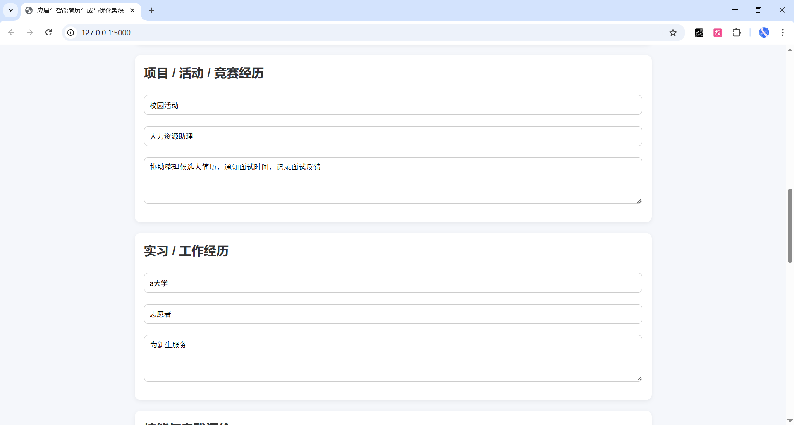
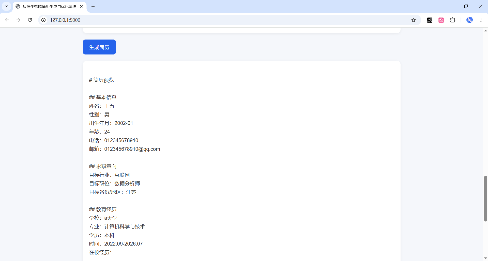
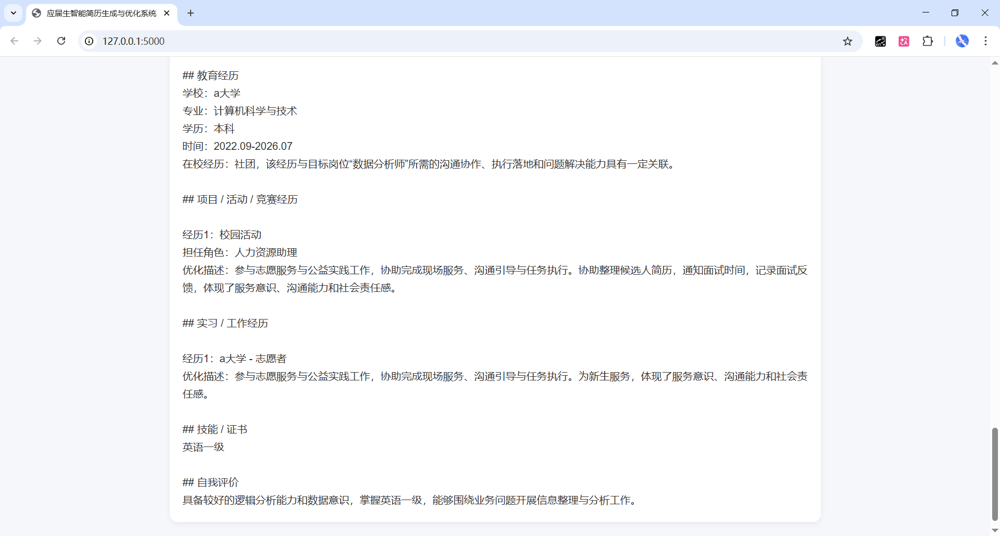

# AI Resume Builder（应届生简历生成系统）

这是一个我自己做的简历生成小项目，主要是想解决一个比较实际的问题：
很多应届生其实有经历，但不知道怎么把这些经历写成一份“像样的简历”。

这个系统的作用就是：
👉 把用户输入的原始信息，整理并优化成一份更专业的简历内容。

---

## 项目主要做了什么

用户在页面上填写：

* 基本信息（姓名、性别、出生年月等）
* 求职意向（行业 / 职位 / 地区）
* 教育经历
* 项目 / 活动 / 竞赛经历（支持多条添加）
* 实习 / 工作经历（支持多条添加）
* 技能和自我评价

点击生成后，系统会：

* 自动整理成简历结构
* 对用户输入的内容进行简单优化
* 根据不同类型经历（技术 / 文案 / 行政 / 活动等）调整表达方式

---

## 一个简单例子

用户输入：

> 负责活动签到和物资分发

系统生成：

> 参与活动现场组织与执行工作，负责签到管理与物资分发，保障活动流程顺利进行，体现了较强的执行能力和组织协调能力。

---

## 技术实现（简单说明）

这个项目没有用复杂模型，主要是用规则来实现：

* 后端用 Flask，负责接收数据和生成简历内容
* 前端用原生 HTML + CSS + JavaScript
* 通过关键词判断经历类型（比如技术 / 数据 / 文案 / 行政等）
* 用不同模板对描述进行重写

---

## 已实现的功能

* 表单输入 + 简历生成
* 出生年月自动计算年龄
* 行业 / 地区 / 学历等下拉选择
* 多项目、多实习动态添加（+按钮）
* 简历结果以“页面模板”形式展示
* 支持多类型专业（不仅限计算机）

---

## 页面效果

### 表单填写页面



### 简历生成结果



### 内容优化示例



---

## 可以改进的地方

目前这个项目还是一个基础版本，后面可以继续做：

* 导出 PDF 简历
* 更接近真实简历的排版（左右分栏等）
* 支持中英文切换
* 引入大模型做更自然的优化

---

## 运行方式

```bash
pip install flask
python backend/app.py
```

浏览器打开：

http://127.0.0.1:5000

---

## 一点想法

这个项目其实更偏“产品 + 工程”的练习。

重点不是算法有多复杂，而是把一个真实需求完整做出来：
从用户输入 → 内容处理 → 输出结果 → 页面展示。
git add README.md